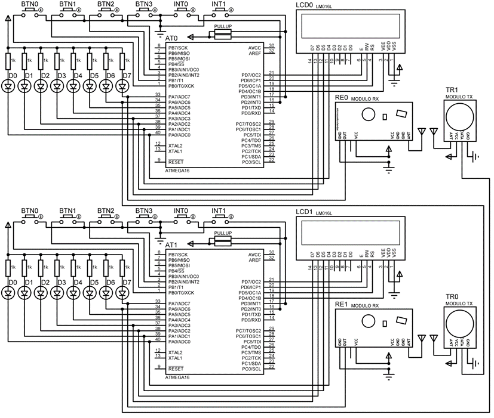

# AVR-Dual-RF-Communication
Simplex RF Communication between 2 AVR-based microcontrollers.

> This project was created as a final project for the Embedded Systems course.

## Functionalities

* Sending and receiving of typed messages (32. character maximum) over RF connection
* Ability to change the board operation mode (transmitting or receiving)
* User interface
  * Visual message editor (on the 2x16 LCD)
  * Progress indicator while transmitting

## Hardware requirements

Any megaAVR compatible 8-bit microcontroller, 16x2 Hitachi HD44780 compatible LCD controller, and VirtualWire compatible Transmitter and Receiver.
Keep in mind that 2 of each are needed in order to display a functional RF communication.

Optionally, 8 LED diodes connected to PA0-PA7.

The hardware we tested on was:
* Sintech AVR mega16/32 Mini Development Board
* Sparkfun ADM1602K1-FS(RGB)-FBW LCD
* XD-FST Transmitter
* XD-RF-5V Receiver

A full schematic to connect everything correctly is presented below.

## Software requirements

A full Atmel studio installation with a megaAVR compiler is required. At the moment this project was finalized, Atmel Studio 7 was the latest version.

Depending on the clock speed, select the 7.37MHz or 8.00MHz version (if the clock speed is not either of those, you can calculate the required changes in the files manually).

Any method of flashing the compiled executable code to the board is supported.

## User interface

If optional 8 LED diodes are connected, their functionalities are as follows:
* LED Diodes 0-3 present LCD screen activity (i.e. if they are not flashing, LCD is not working correctly).
* LED Diode 4 signals the current operating mode
  * If turned on it is in transmitting mode
* LED Diode 5 is currently unused
* LED Diode 6 indicates transmitter activity
* LED Diode 7 indicates receiver activity

The buttons have the following functionalities:
* BTN0 and BTN1 are used for changing the currently selected character on the LCD screen (which is indicated by the cursor).
  * BTN0 scrolls through the character list in descending order
  * BTN1 scrolls through the character list in ascending order
* BTN2 moves right to the next character
* BTN3 transmit the message
* INT0 and INT1 are both used to toggle operating mode
